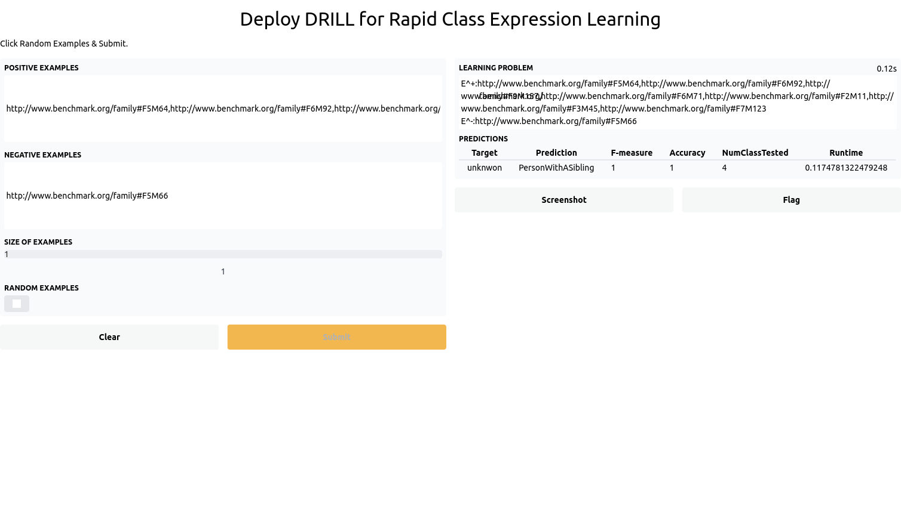
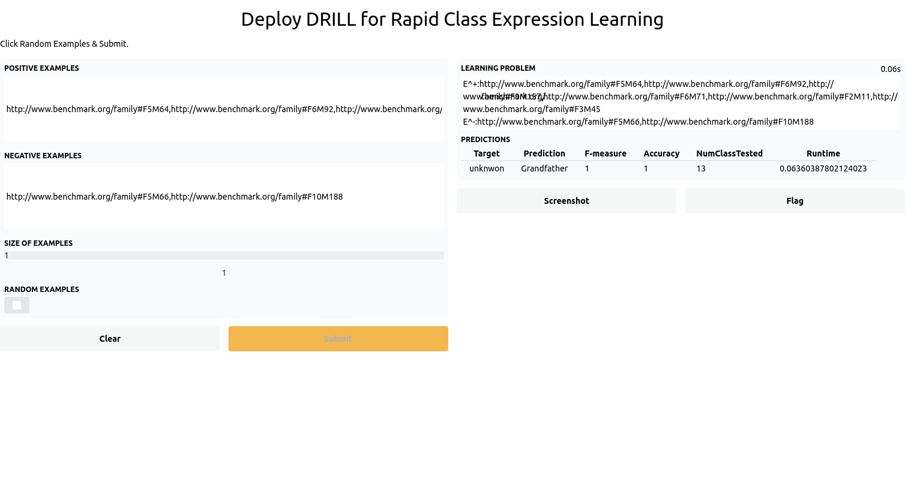
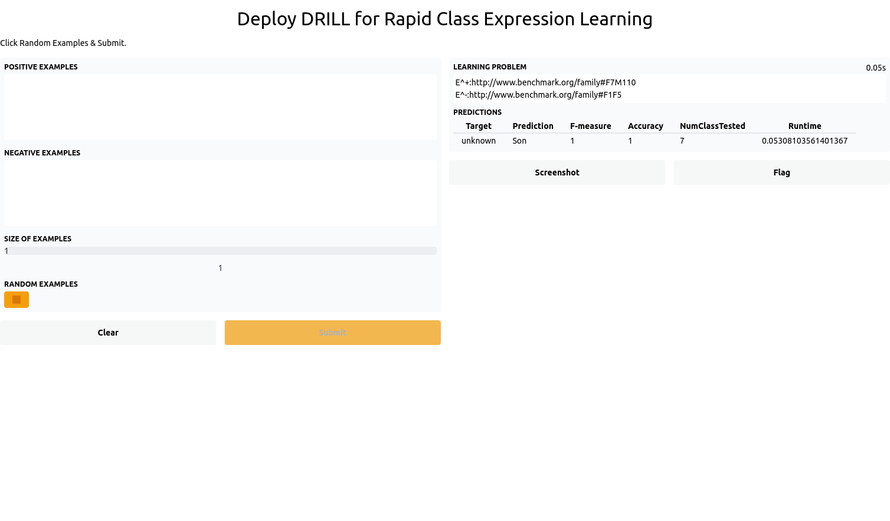

# Deep Reinforcement Learning for Refinement Operators in ALC

This open-source project contains the Pytorch implementation of DRILL, training and evaluation scripts. 
To foster further reproducible research, we provide pretrained models on all datasets.
To easy the usage of DRILL, we also provide a deployment service.

# Installation
Create a anaconda virtual environment and install dependencies.
```
# Create anaconda virtual enviroment
conda create -n drill_env python=3.9
# Active virtual enviroment 
conda activate drill_env
# Install our developed framework. It may take few minutes
pip install -e .
# Test the installation. No error should occur.
python -c "import ontolearn"
# For the deployment, please run pip install gradio==2.4.6
```
# Preprocessing 
Unzip knowledge graphs, embeddings, learning problems and pretrained models.
```
unzip KGs.zip
unzip embeddings.zip
unzip pre_trained_agents.zip
unzip LPs.zip
```
# Prepare DL-Learner
Download DL-Learner.
```
# Download DL-Learner
wget --no-check-certificate --content-disposition https://github.com/SmartDataAnalytics/DL-Learner/releases/download/1.4.0/dllearner-1.4.0.zip
unzip dllearner-1.4.0.zip
# Test the DL-learner framework
dllearner-1.4.0/bin/cli dllearner-1.4.0/examples/father.conf
```
## Reproduce experiments
We provide logs of our experiments
- ``` large_benchmark_script_full_output.txt ``` and ``` large_benchmark_script_summary_output.txt ``` contain logs of our experiments on 370 automatically generated learning.
- ``` small_benchmark_script_full_output.txt ``` and ``` small_benchmark_script_summary_output.txt.txt ``` contain logs of our experiments on 18 benchmark learning problems.
 
To ease the reproducibility of our experiments, we prove scripts for training and testing.
- ``` sh reproduce_small_benchmark.sh ``` reproduces results on benchmark learning.
- ``` sh reproduce_large_benchmark.sh ``` reproduces results on 370 benchmark learning.
- ``` drill_train.py``` allows to train DRILL on any desired learning problem.

# Deployment
To ease using pre-trained model, we provide an API for the deployment. The following script will deploy pretrained DRILL on the family benchmark dataset.
```sh
python deploy_demo.py 
# Few seconds later, pretrained model is deployed in a local server
Running on local URL:  http://127.0.0.1:7860/
```



